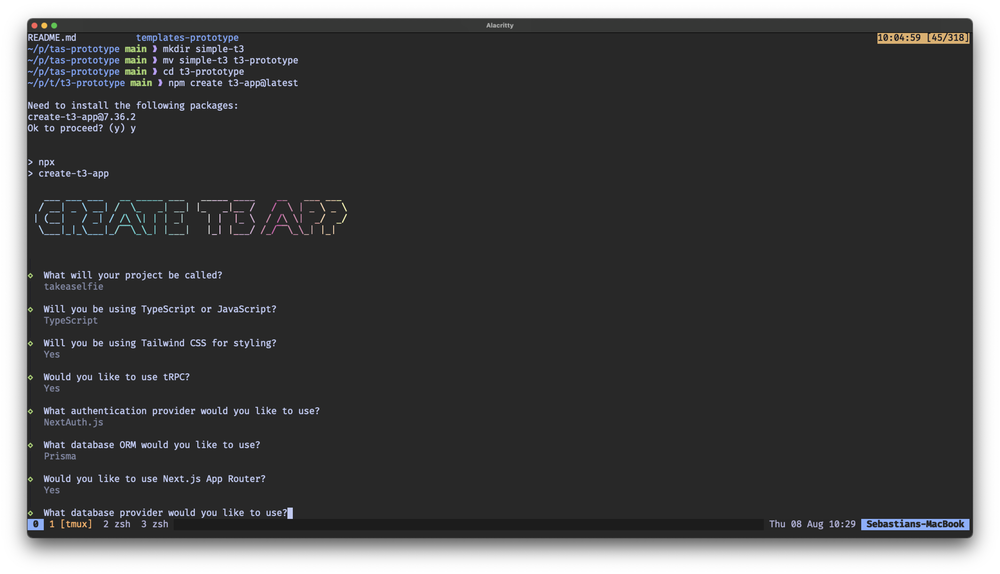
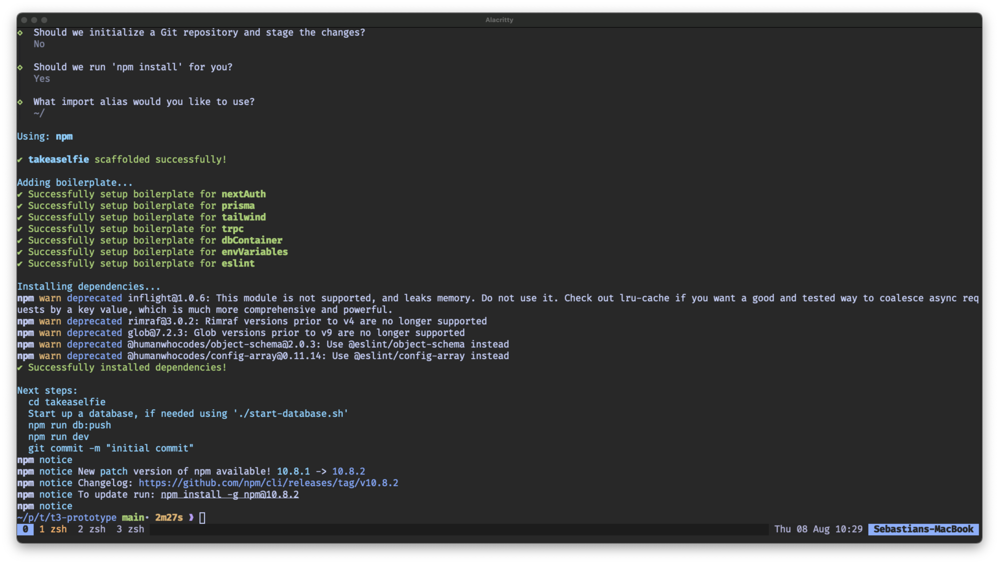

# the t3 stack

initial thoughts:

1. added lots of boilerplate automatically - nice :)
2. easy to get started just write `create-t3-app` and asks how to configure it
3. not a good sign when just from installing things it already has
   `npm warn depricated` messages

